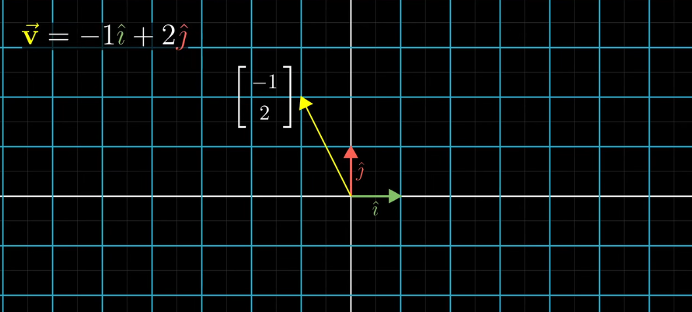
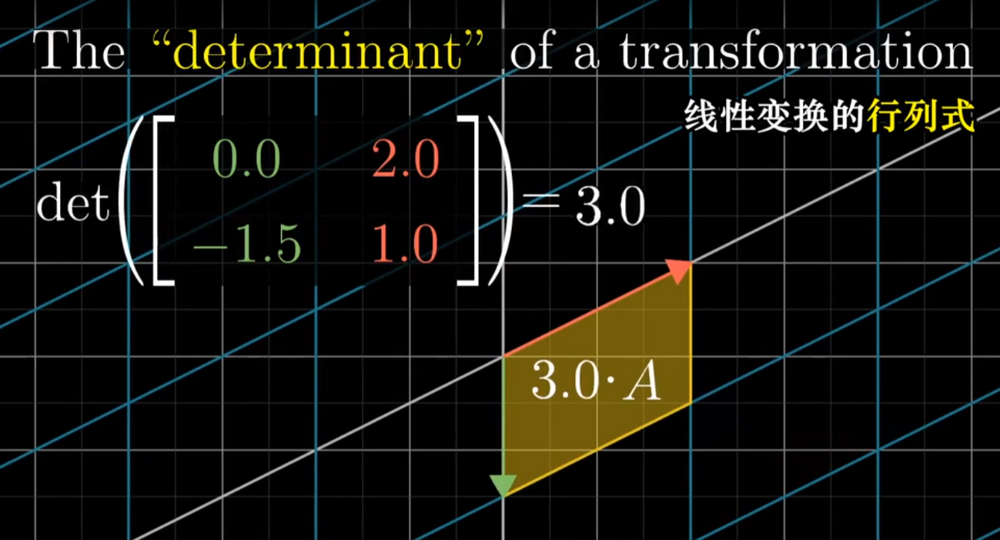
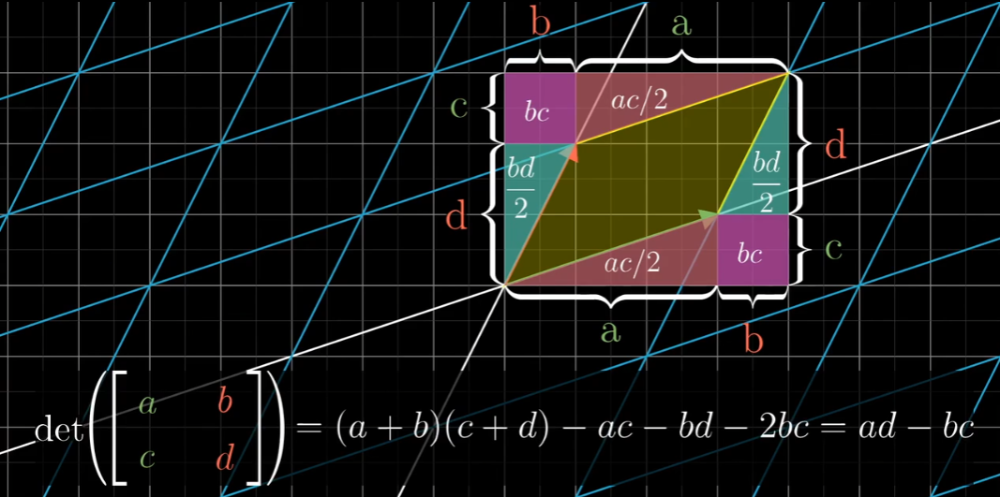

# 对线性代数的思考
## 线性变换
### 变换本质

我们可以把原本拥有的坐标系看成两个向量i,j所构建成的一个网格。那么我们就可以把这样的一个坐标系统写成下面的形式
$$
\left[
\matrix{
	i右, j右 \\i上, j上
}
\right]

\left[
\matrix{
	1, 0 \\0, 1
}
\right]
$$
我们把默认的坐标当作图上右部分的矩阵，然后我们对这个矩阵进行任何操作都会使空间的网格跟随变换。

例如我们有一个点[2,3],我们通过坐标系统矩阵*点坐标就可以得出变换后的坐标
$$
\left[
\matrix{
	1, 0\\0, 1
}
\right]
*
\left[
\matrix{
	2\\3
}
\right]
=
\left[
\matrix{
	2\\3
}
\right]
\\
逆转90度后 坐标系统为
\left[
\matrix{
	0, -1\\1,  0
}
\right]
\\
\left[
\matrix{
	0, -1\\1,0
}
\right]
*
\left[
\matrix{
	2\\3
}
\right]
=
\left[
\matrix{
	-3\\2
}
\right]
$$
因此我们可以得出旋转矩阵实际上就是:
$$
\left[
\matrix{
	cosx,  sinx\\
	-sinx,  cosx
}
\right]
\\
i = [cosx, -sinx]\\
j = [sinx, cosx]
$$
这里的话i和j为两个我们构建出网格的轴，三维的话推算方法也是类似的。

### 三维旋转

我们没有办法通过一次乘法来达到一个三维旋转的效果。 因为比起二维画面里的单维度旋转，在三维空间上有三个不同维度的旋转(围绕x，围绕y，围绕z)。

因此我们在进行三维旋转的时候需要把旋转过程拆分成三次旋转，而最原始的二维的在这里就是围绕z的旋转。

这时候三个旋转的顺序肯定是对结果有一定影响的，所以我们会遇到万向锁这样的问题。

### 顺序

当我们需要先旋转，再缩放的时候，我们需要这样进行操作：
$$
[缩放] * ([旋转] * [ 点])
$$
虽然先旋转后缩放，但是在变换操作里我们要把后来的放在左边。 这样的话例如mvp变换在我们的shader里就会写成p * v * m * vertex的形式。当然这里我们并不需要先去展开model * vertex，完全可以先从 p * v * m算起，不影响最终结果，只是要注意左到右展开的顺序是和实际变换顺序相反的。

## 行列式 Determinant

### 本质

当我们对坐标的i和j进行一定的操作的时候，我们原本坐标[0,0] 到 [1,1] 这个长方形所覆盖的面积会增加。

当我们的坐标 i变成[2,0] j变成[0,3]，那么我们从[0,0]到[1,1]的面积将会变成原来的6倍。

对单位变换面积的变化的值，就是determinant

行列式是可以有负数的，假设有负数，那表示我们的图在空间中进行了一个反转，也就是i和j轴的相对位置对调了。

在3d空间中，我们把determinant的负数当作左右手坐标系的对调。假设我们用的是右手坐标系，然后变换后determinant为负数，这个意思就是我们最后形成的坐标变成了左手坐标系下的坐标网格。

